# Lapres Modul 2 Jaringan Komputer

---

<ul>
    <li>05111840000039 - Sitti Chofifah</li>
    <li>05111840000139 - Dohan Pranata W </li>
</ul>

## Soal

### Nomer 1,2, dan 3

**Membuat sebuah website utama dengan alamat http://semeruyyy.pw yang memiliki alias http://www.semeruyyy.pw, dan subdomain http://penanjakan.semeruyyy.pw yang diatur DNS-nya pada MALANG dan mengarah ke IP Server PROBOLINGGO**

Buka UML server MALANG lakukan `apt-get update` dan install bind9 pada UML MALANG. Setelah itu lakukan `nano /etc/bind/named.conf.local`.
Konfigurasi server MALANG seperti gambar dibawah :

Lalu di buat folder sesuai dengan `file` di konfigurasi sebelumnya
`mkdir /etc/bind/semeruyyy`
lalu lakukan `cp /etc/bind/db.local /etc/bind/semeruyyy/semerub11.pw` sesuai soal nomer 1,2,3 dimana di suruh buat alamat http://semeruyyy.pw\_ yang memiliki alias http://www.semeruyyy.pw, dan subdomain http://penanjakan.semeruyyy.pw dan diarhakan ke server PROBOLINGGO( "10.151.83.100").

lalu lakukan restart bind9 dengan inputkan `service bind9 restart`

Untuk cek konfigurasi tersebut dapat melakukan ping ke alamt yang sudah kita buat melalui client GRESIk atau SIDOARJO dan jangan lupa untuk untuk menambah nameserver pada Client Server dengan :

> nano /etc/resolv.conf

dan tambahkan `nameserver "IP MALANG"` seperti gambar berikut

dan lakukan ping di salah satu client `ping semerub11.pw` , `ping www.semerub11.pw` , dan `ping penanjakan.semerub11.pw` seperti gambar berikut yang dilakukan di client GRESIK :

### Nomer 4

**Membuat reverse domain untuk domain utama**
Untuk membuat reverse domain utama inputkan `nano /etc/bind/named.conf.local` pada uml MALANG dan melakukan konfigurasi file tersebut dengan inputkan

> zone "83.151.10.in-addr.arpa" {
> type master;
> filr "/etc/bind/semeruyyy/83.151.10.in-addr.arpa";
> }

seperti gambar berikut :

setelah itu copykan file db.local ke dalam file 83.151.10.in-addr.arpa pada folder jarkom dengan perintah `cp /etc/bind/db.local /etc/bind/jarkom/83.151.10.in-addr.arpa` setelah file tersebut di konfigurasi seperti gambar berikut :

lalu restart bind9 dengan melakukan perintah `service bind9 restart` dan untuk mengeceknya pada salah satu clinet kita install dulu dnsutils dengan perintah apt-get install dnsutils lalu inputkan perintah `host -t PTR 10.151.83.100` pada salah satu client tersebut. Berikut hasilnya :

### Nomer 5

**Membuat Server Slave di MOJOKERTO**
Konfigurasi Pada Server MALANG.
Edit file /etc/bind/named.conf.local dan disesuaikan dengan syntax berikut :

Restart bind9 dengan melakukan perintah `service bind9 restart`
lalu lakukan konfigurasi pada server di mojokerto dengan menjalankan perintah `apt-get update` dan install bind9 pada server mojokerto.
Kemudian buka file `/etc/bind/named.conf.local` pada MOJOKERTO dan ditambhakan syntax seperti gambar berikut :

dan restart bind9.

untuk testing pada nameserver di CLIENT arahkan ke ip mojokerto dan matikan bind9 pada malang. Lakukan ping ke semerub11.pw di CLIENT. Beikut gambarnya :

### Nomer 6.

**Membuat sub domain http://gunung.semerub11.pw yang didelegasikan di server MOJOKERTO dan diarahkan ke server Probolinggo**
untuk mendelegasikan sub domain di server MOJOKERTO. Server malang kita konfigurasi dulu pada file semerub11.pw, dengan menambahkan

> ns1 IN A 10.151.83.99
> gunung IN A ns1

seperti gambar di bawah :
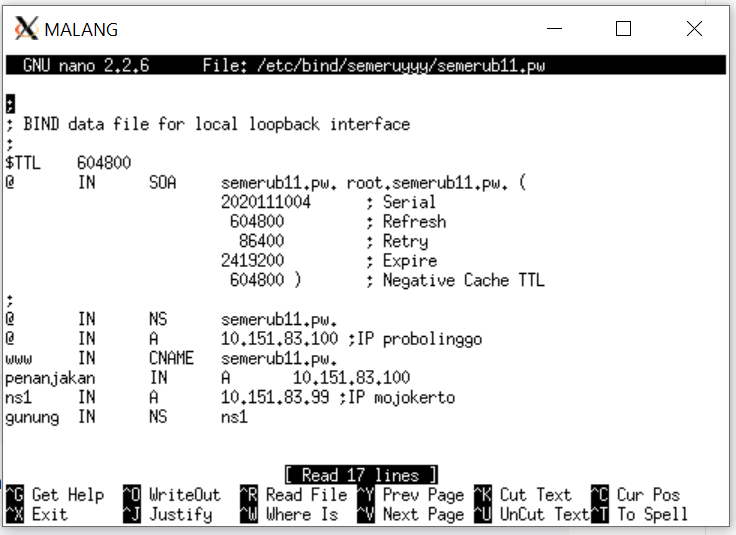

selanjutnya konfigurasi file `/etc/bind/named.conf.options` seperti gambar di bawah :

restart bind9.
Konfigurasi server MOJOKERTO. Buka file /etc/bind/named.conf.options
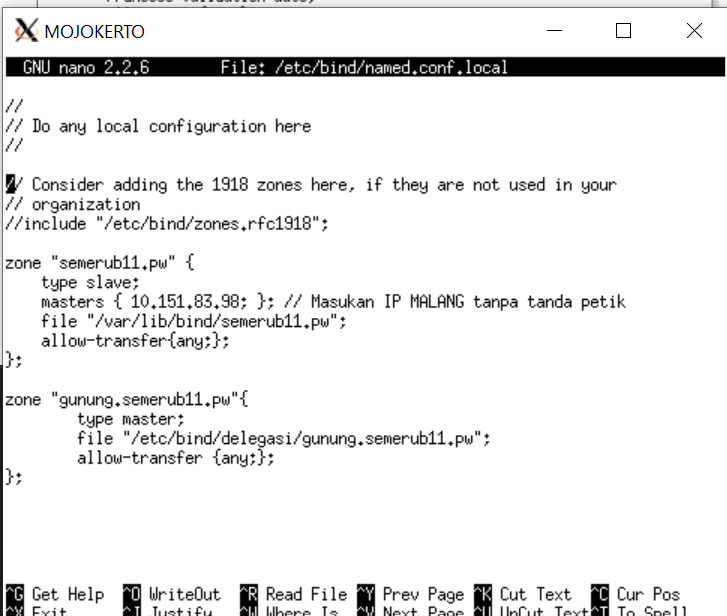

Lanjut membuat directory delegasi mkdir /etc/bind/delegasi
Kemudian edit nano /etc/bind/delegasi/gunung.semerub11.pw
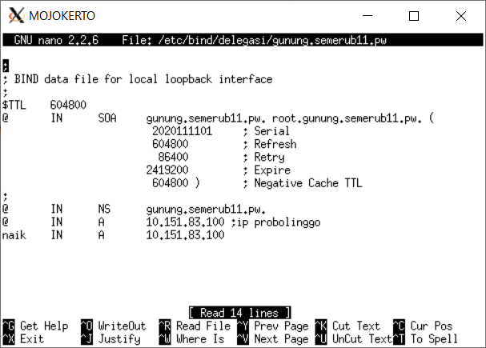

Selanjutnya lakukan test ping gunung.semerub11.pw di gresik
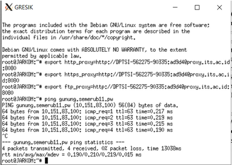

### Nomer 7

**Membuat subdomain dengan nama http://naik.gunung.semeruyyy.pw, main ini diarahkan ke IP Server PROBOLINGGO.**

Lakukan edit file nano /etc/bind/delegasi/gunung.semerub11.pw pada mojokerto dan tambahkan konfigurasi

> naik IN A 10.151.83.100

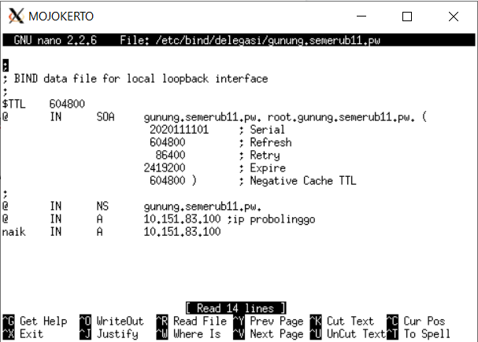

Selanjutnya lakukan test ping naik.gunung.semerub11.pw di gresik :
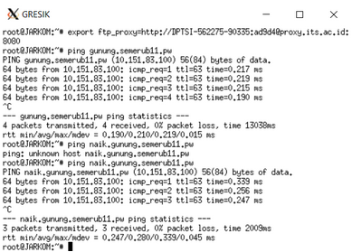

### Nomer 8

**Membuat domain http://semeruyyy.pw memiliki Document Root pada /var/www/semeruyyy.pw.**

Lakukan perintah `cd /etc/apache2/sites-available` di Probolinggo
Kemudian edit file nano semerub11.pw dan tambahkan konfigurasi seperti gamabr dibawah ini :
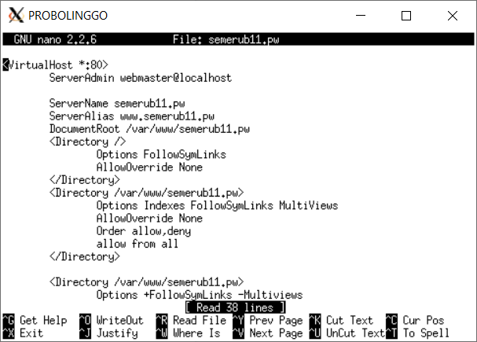

Selanjutnya pindah ke directory /var/www

Kemudian gunakan perintah wget 10.151.36.202/semeru.pw.zip untuk mendownload file yang sudah disediakan pada soal praktikum dan selanjutnya jangan lupa untuk unzip file

Setelah semua sudah selesai, buka browser dan akses semerub11.pw
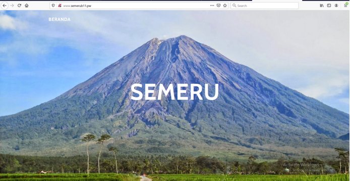

### Nomer 9

**Menggunakan mod rewrite agar urlnya menjadi http://semeruyyy.pw/home.**

Untuk menggunakan mod rewrite menuju ke file rootnya semerub11.pw yaitu dengan

> cd /var/www/semerub11.pw

lalu ubah file .htacces nya dengan menggunakan `nano .htaccess` dan ubha file tersebut seperti gambar berikut :
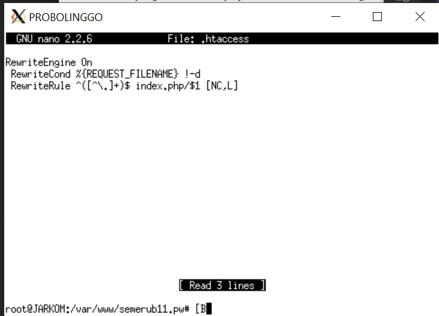

lalu cek di browser seperti gambar berikut :
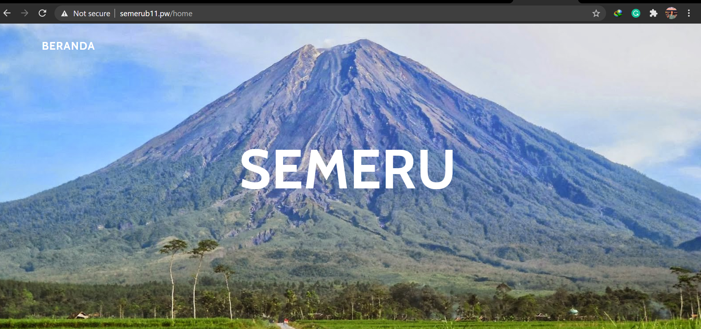

### Nomer 10 dan 11

**Web http://penanjakan.semeruyyy.pw akan digunakan untuk menyimpan assets file yang memiliki documentRoot pada /var/www/penanjakan.semeruyyy.pw dan memiliki struktur folder sebagai berikut:**
/var/www/penanjakan.semeruyyy.pw

<ul>
<li>/public/javascripts
<li>/public/css
<li>/public/images
<li> /errors
</ul>

**Pada folder /public dibolehkan directory listing namun untuk folder yang berada di dalamnya tidak dibolehkan**

Unzip dulu file yag sudah di download di folder `var/www/` yaitu `penanjakna.semeru.pw.zip` lalu rename namanya menjadi `penanjakna.semerub11.pw.zip`.

lalu Pindah ke directory `/etc/apache2/` sites-available dengan perintah `cd /etc/apache2/sites-available` Copy file default menjadi file penanjakan.semerub11.pw, Buka file penanjakan.semerub11.pw, lalu tambahkan

> ServerName penanjakan.semerub12.pw
> ServerAlias www.penanjakan.semerub12.pw

Kemudian ubah DocumentRoot menjadi /var/www/penanjakan.semerub11.pw seperti gambar berikut :
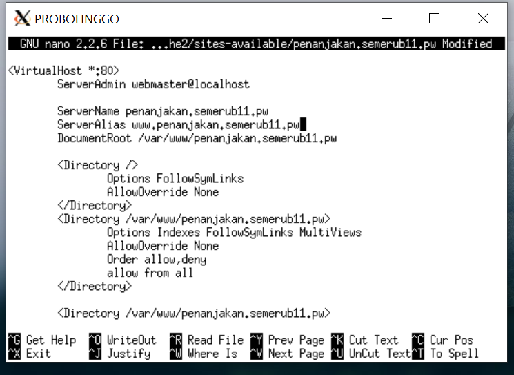

lalu jalankan `a2ensite penanjakan.semerub11.pw` untuk mengaktifkan web dan restart apache2.

lalu buka alamat `penanjakan.semerub11.pw` di browser
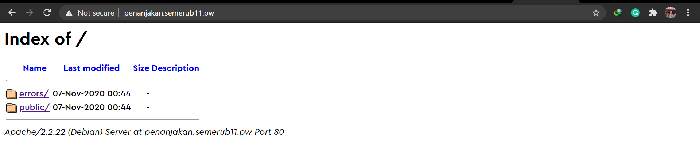

setelah itu untuk setting access buka kembali file konfigurasi penanjakan.semerub11.pw dengan `nano /etc/apache2/sites-available/penanjakan.semerub11.pw` lalu tambahkan

> <Directory /var/www/penanjakan.semerub12.pw/public>
> Options +Indexes
> \</Directory>

dan untuk folder di dalam public yang tidak boleh di access dapat menambahakan

> <Directory /var/www/penanjakan.semerub12.pw/public/images>
> Options -Indexes
>
> \</Directory>
> <Directory /var/www/penanjakan.semerub12.pw/public/css>
> Options -Indexes
> \</Directory>
>
> <Directory /var/www/penanjakan.semerub12.pw/public/javascripts>
> Options -Indexes
> \</Directory>

Seperti gambar berikut :
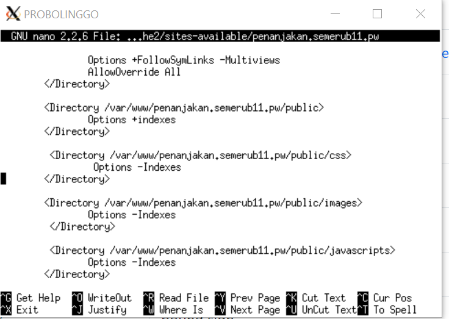

lalu restart apaceh2 dengan `service apache2 restart` lalu cek di browser da hasilnya seperti berikut :
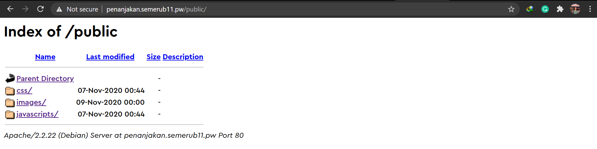
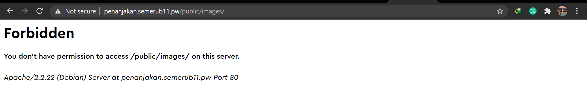
