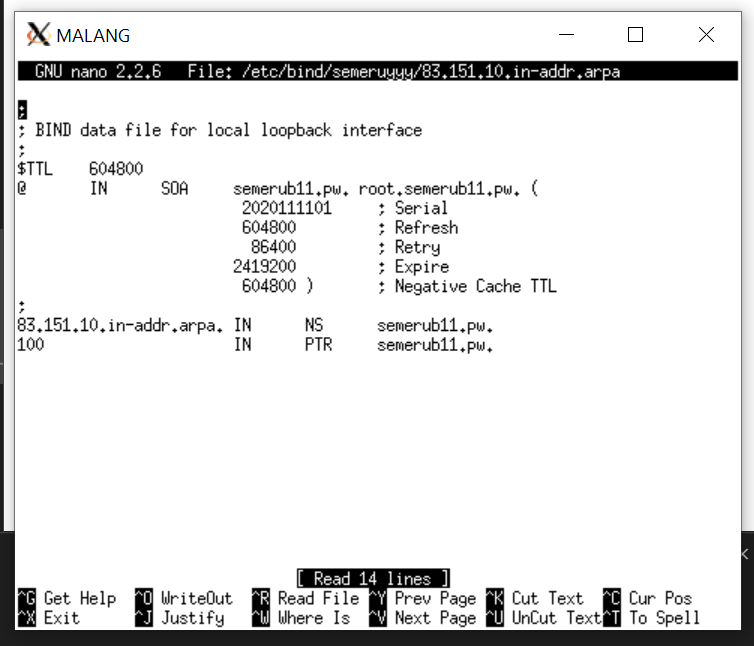

# Lapres Modul 2 Jaringan Komputer

---

<ul>
    <li>05111840000039 - Sitti Chofifah</li>
    <li>05111840000139 - Dohan Pranata W </li>
</ul>

## Soal

#### Nomer 1,2, dan 3

**Membuat sebuah website utama dengan alamat http://semeruyyy.pw yang memiliki alias http://www.semeruyyy.pw, dan subdomain http://penanjakan.semeruyyy.pw yang diatur DNS-nya pada MALANG dan mengarah ke IP Server PROBOLINGGO**

Buka UML server MALANG lakukan `apt-get update` dan install bind9 pada UML MALANG. Setelah itu lakukan `nano /etc/bind/named.conf.local`.
Konfigurasi server MALANG seperti gambar dibawah :

Lalu di buat folder sesuai dengan `file` di konfigurasi sebelumnya
`mkdir /etc/bind/semeruyyy`
lalu lakukan `cp /etc/bind/db.local /etc/bind/semeruyyy/semerub11.pw` sesuai soal nomer 1,2,3 dimana di suruh buat alamat http://semeruyyy.pw\_ yang memiliki alias http://www.semeruyyy.pw, dan subdomain http://penanjakan.semeruyyy.pw dan diarhakan ke server PROBOLINGGO( "10.151.83.100").

lalu lakukan restart bind9 dengan inputkan `service bind9 restart`

Untuk cek konfigurasi tersebut dapat melakukan ping ke alamt yang sudah kita buat melalui client GRESIk atau SIDOARJO dan jangan lupa untuk untuk menambah nameserver pada Client Server dengan :

> nano /etc/resolv.conf

dan tambahkan `nameserver "IP MALANG"` seperti gambar berikut

dan lakukan ping di salah satu client `ping semerub11.pw` , `ping www.semerub11.pw` , dan `ping penanjakan.semerub11.pw` seperti gambar berikut yang dilakukan di client GRESIK :

#### Nomer 4

**Membuat reverse domain untuk domain utama**
Untuk membuat reverse domain utama inputkan `nano /etc/bind/named.conf.local` pada uml MALANG dan melakukan konfigurasi file tersebut dengan inputkan

> zone "83.151.10.in-addr.arpa" {
> type master;
> filr "/etc/bind/semeruyyy/83.151.10.in-addr.arpa";
> }

seperti gambar berikut :

setelah itu copykan file db.local ke dalam file 83.151.10.in-addr.arpa pada folder jarkom dengan perintah `cp /etc/bind/db.local /etc/bind/jarkom/83.151.10.in-addr.arpa` setelah file tersebut di konfigurasi seperti gambar berikut :

lalu restart bind9 dengan melakukan perintah `service bind9 restart` dan untuk mengeceknya pada salah satu clinet kita install dulu dnsutils dengan perintah apt-get install dnsutils lalu inputkan perintah `host -t PTR 10.151.83.100` pada salah satu client tersebut. Berikut hasilnya :

#### Nomer 5

**Membuat Server Slave di MOJOKERTO**
Konfigurasi Pada Server MALANG.
Edit file /etc/bind/named.conf.local dan disesuaikan dengan syntax berikut :

Restart bind9 dengan melakukan perintah `service bind9 restart`
lalu lakukan konfigurasi pada server di mojokerto dengan menjalankan perintah `apt-get update` dan install bind9 pada server mojokerto.
Kemudian buka file `/etc/bind/named.conf.local` pada MOJOKERTO dan ditambhakan syntax seperti gambar berikut :

dan restart bind9.

untuk testing pada nameserver di CLIENT arahkan ke ip mojokerto dan matikan bind9 pada malang. Lakukan ping ke semerub11.pw di CLIENT. Beikut gambarnya :

